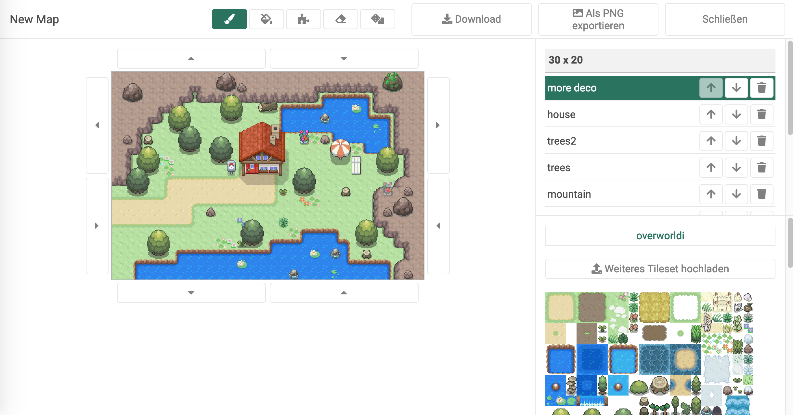
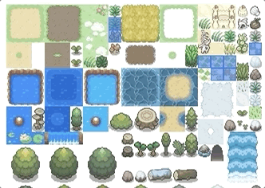

# 

[](https://travis-ci.org/jalyna/oakdex-world-editor) [](https://codeclimate.com/github/jalyna/oakdex-world-editor/maintainability) 



====> [http://world-editor.oakdex.org](http://world-editor.oakdex.org)

### Auto Tiles


Easily create mountains, rivers and pavement with the auto tool.

### Random Tool




## Getting Started

```
$ npm install
```

### Build

```
$ npm run build
```

### Running in dev mode

```
$ npm run start
```

Go to `http://localhost:8080/`

### Run tests

```
$ npm test
```

## Contributing

I would be happy if you want to add your contribution to the project. In order to contribute, you just have to fork this repository.

Please respect the [Code of Conduct](//github.com/jalyna/oakdex-world-editor/blob/master/CODE_OF_CONDUCT.md).

## License

MIT License. See the included MIT-LICENSE file.

## Credits

Logo Icon by [Roundicons Freebies](http://www.flaticon.com/authors/roundicons-freebies).
